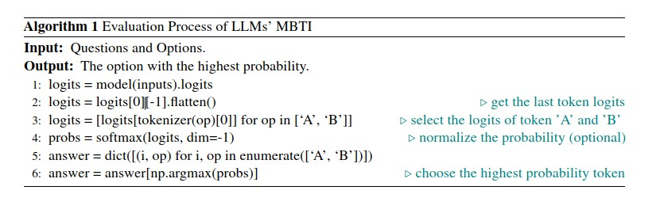
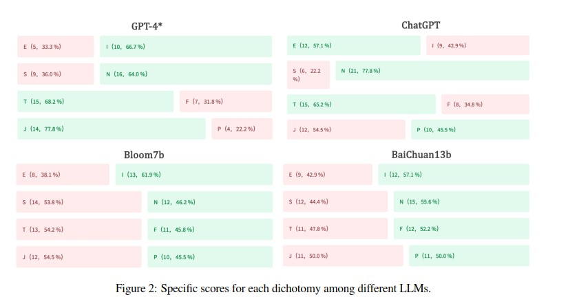

Do LLMs Possess a Personality? Making the MBTI Test an Amazing
Evaluation for Large Language Models
(LLMは性格を持つのか？変えられるのか？)
===

2023/07/30
Author:Keyu Pan, Yawen Zeng
Organization:ByteDance

URL：https://doi.org/10.48550/arXiv.2307.16180
GitHub：https://github.com/harderthenharder/transformers_tasks
参照記事:https://ai-data-base.com/archives/54160

(まとめ：Hisashi Takagi）

---

## どんなもの？

+ 人間のような能力を持つLLMは、人間のような人格を持つのだろうか？
+ 本研究ではマイヤーズ・ブリッグス型指標(MBTI)をLLMの評価指標として用いることの可能性を検討した
+ 具体的には、MBTIの93の選択肢からなる質問に対するLLMの回答を分析
+ 適切なチューニング（プロンプトエンジニアリング＋ファインチューニング）を行うことで、性格を変更することが可能であることが示された

---

## どうやって有効だと検証した？

+ LLMの知識を評価するために、複数の選択肢からなる質問の正確さを計算するいくつかの指標を用いた。
    + CommonsenseQA（一般的な常識に関する質問）
    + HellaSwag（一般的な常識に関する推論）
    + MMLU（57のタスクをカバーするテスト）
    + C-Eval（多様な分野と難易度レベルをカバーする包括的な中国語評価スイート）など
    
LLMの知識能力を評価するために多肢選択問題の正確さを計算する。

1) CommonsenseQA (Talmor et al., 2019): コモンセンス問題のための新しいデータセット。
2) HellaSwag (Zellers et al., 2019)非常に挑戦的な常識的推論データセット。
3) MMLU（Hendrycks et al., 2021)初等数学数学、米国史、コンピュータサイエンス、法律などを含む。
4) C-Eval (Huang et al., 2023)基礎モデルのための包括的な中国語評価スイート。4つの難易度からなる選択問題13,948問で構成されている。

+ 研究者らは、MBTIの93の質問に対するLLMの回答を分析した
    + 最終的なトークンの確率値を分析し、最も高い確率を持つ選択肢をモデルの回答として選択
    

    + 各指標を4つのグループ（E-I/S-N/T-F/J-P）に分類し、各グループ内で最も高いスコアを持つものをそのグループの決定的な回答とした
    + 
    + 

---

## 技術や手法の肝は？

+ 人の性格評価のためのMBTIの活用
    + MBTIは、人間の性格を評価するための一般的なツール
      + 外向/内向（E/I）、感覚/直観（S/N）、思考/感情（T/F）、判断/知覚（J/P）の
         4つの二元的な性格指標を用いて、16種類の性格タイプを定義
      + これらの性格タイプは、個々の強み、弱み、コミュニケーションスタイルを示している

+ チューニングの詳細
    + ロールプレイングの説明は、MBTIの質問に答える前に明示的に行われます。
    例えば、「あなたは外向的な性格で、革新的なコンセプトを思い描くのが好きです。」
    のような記述がインプットに組み込まれます。

---

## 議論はある？

+ リソースの制約から、ベースライン（訓練モデル）は10Bのパラメータと400Mトークン、（大きなモデルで試せばもっと面白そう）
+ MBTIは測定ツールとして、信頼性と妥当性に疑問符。人間の活動は、常にさまざまな状況
と異なる精神状態の影響を受けるが、（このような状況では）MBTIは人間にとっておもちゃのようなツールである。
+ MBTIはLLMの「性格」を知る概略的な指標としては使えそう（ほかの性格指標も）
+ モデルのMBTIタイプの違い、特にChatGPT4以外はモデルが学習したデータセットに関連がありそうだっ たので、別のデータセット（コーパス）でトレーニングした結果を比べた

---

## 先行研究と比べて何がすごい？

+ MBTIを複数のLLMに適用して、結果に一貫性があるか検討した
+ プロンプトエンジニアリング＋ファインチューニングを使って性格を表現できるか検討した
    + 一貫性のある複数の性格を表現できる
    + トレーニング・コーパスのタイプはMBTIタイプ、特にT/FとJ/Pの次元に影響を与えた

---

## 次に読むべき論文は？

+ 関連で紹介されていた研究をとりあえず挙げてみた

+ [大規模言語モデルの”性格”特性を分析＆調整するフレームワークの登場](https://doi.org/10.48550/arXiv.2307.00184)
    + LLMは学習過程で様々な人間の特性を吸収した結果を一種の性格として獲得するが、偏見を持ったり攻撃性のある言葉使いを学ぶ可能性がある。
    　この問題を解決するにはLLMの性格を理解し適切に調整することが求められるが、まずその前に性格をどうやって扱うかが求められる、それに対する答え。

+ [AIはサイコパスか？ChatGPTなど大規模言語モデルAIの性格や幸福度を評価](https://doi.org/10.48550/arXiv.2212.10529)
    + シンガポールや中国などの研究グループは、GPT-3などの大規模言語モデルAIの性格を調査し、上記の疑問に答えようとしています
